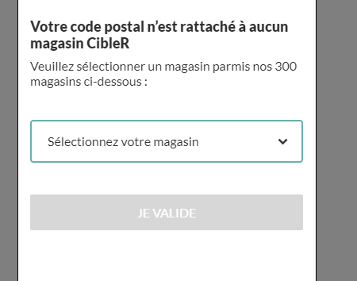
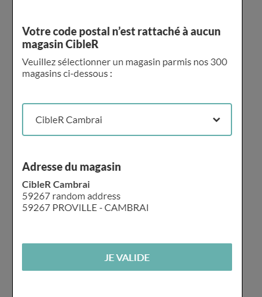

# README #

Storybook test

### How do I get set up? ###

* Clone the repo
* `npm install`
* `npm run storybook`

Please commit on a new branch and make a pull request.
Create several components and call then in `./stories/assets/scss/dom-tom.js`, 
add your css style in `./stories/assets/scss/dom-tom.scss` and the new components 
in `./stories/src/mobile/components/`

### Expected render

On page loading with no shop selected  

After selection

